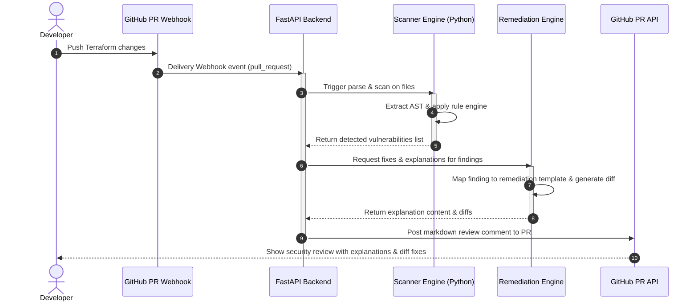

# SentraAI Technical Architecture

SentraAI uses a monorepo setup optimized for low operational costs, deterministic behavior, and extreme speed.

## System Data Flow

The following Mermaid diagram outlines the automated security scanning and remediation workflow:



---

## Folder Organization & Components

### 1. `backend/` (FastAPI)
* Exposes the webhook receiver endpoints.
* Validates webhook signatures using secret tokens.
* Coordinates between the Scanner Engine and the Remediation Engine.
* Authenticates with GitHub using GitHub App tokens.

### 2. `scanner-engine/` (Python)
* Parses incoming Terraform code blocks or files.
* Matches parsed AST properties against static rules defined in `rules/`.
* Contains zero external API or LLM dependencies for core detection.

### 3. `remediation-engine/` (Python)
* Maps vulnerability IDs to their corresponding, pre-defined remediation templates.
* Generates clear, human-readable explanations of *why* the configuration is dangerous.
* Compiles secure, syntax-valid code diff recommendations.

### 4. `shared/` (Python/Typescript)
* Stores shared type definitions and contracts, ensuring the backend and engines speak the same language.

---

## Finding & Rule Metadata Schema

Every security rule and finding in the system adheres to a strict, standardized metadata schema to ensure consistency:

### Rule Definition Schema

```json
{
  "id": "AWS_S3_PUBLIC",
  "severity": "CRITICAL",
  "title": "Public S3 Bucket Detected",
  "category": "Storage Security",
  "description": "S3 buckets should not have public read access as they risk data exposure of confidential information.",
  "recommended_fix": "Change ACL parameter from 'public-read' to 'private'."
}
```

### Scan Result Finding Schema

When the scanner detects a vulnerability, it outputs findings in the following format:

```json
{
  "rule_id": "AWS_S3_PUBLIC",
  "file_path": "variables.tf",
  "line_number": 12,
  "code_snippet": "acl = \"public-read\"",
  "severity": "CRITICAL",
  "remediation": {
    "explanation": "This S3 bucket is publicly accessible, allowing anyone on the internet to read its contents. Public buckets are a primary source of data leaks.",
    "diff": "@@ -12,1 +12,1 @@\n-  acl = \"public-read\"\n+  acl = \"private\""
  }
}
```

---

## Severity Scale

| Severity | Description | Action Required |
| :--- | :--- | :--- |
| **CRITICAL** | Wildcard admin access, public storage, unencrypted sensitive credentials. | Must fix before merge. Will fail check. |
| **HIGH** | Insecure default ingress, unencrypted DBs, missing security logging. | Highly recommended to fix. Warns in PR. |
| **MEDIUM** | Missing tag policies, long certificate expiry, weak IAM role boundaries. | Review and resolve. Non-blocking warning. |
| **LOW** | Minor style discrepancies, non-standard naming. | Informational only. |
